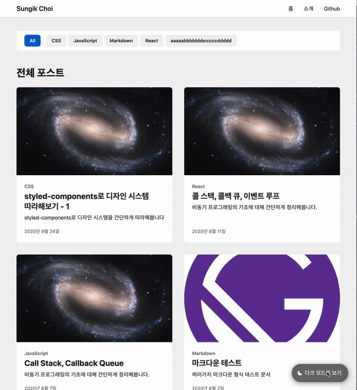
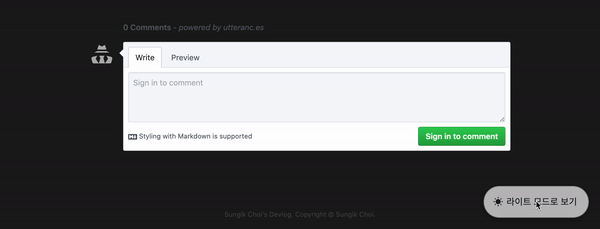

## ❗️ 주의사항

현재 블로그는 SSR 관련 문제로 styled-components 대신 css var를 통해서 테마가 작성됐습니다 😢... 아래 내용은 개발 서버에선 잘 작동하지만, 실제 배포환경에선 그렇지 않았습니다.

제가 겪었던 문제와, 해결법을 잘 정리해서 포스트를 수정할 예정입니다. SSR을 사용하지 않는 페이지에서 본문과 같은 다크모드 적용법은 여전히 유효하다고 생각되므로(utterances 포함) 글 내용을 삭제하진 않겠습니다.

[링크](https://blog.rhostem.com/posts/2020-06-25-dark-mode-for-gatsby-website)에서 문제를 해결하는 데 도움을 많이 받았습니다. 참고 부탁드리며, 조만간 더 좋은 글로 수정해보겠습니다!

## 들어가기 전에

이번에 블로그를 제작하면서, 다크 모드를 처음 도입해보게 되었습니다. 쉽게 적용할 수 있을 거라 생각했는데, 적용 과정 중에 구글 검색만으로는 해결할 수 없는 이슈들이 여러 번 발생했습니다. 댓글이나 코드블럭 플러그인도 함께 다크 모드로 전환되어야 했는데, 이 부분은 검색해도 자료를 찾기가 힘들었습니다. 여러 번 삽질 끝에 잘 적용이 됐고, 어떻게 적용했는지 경험담을 공유하고자 합니다.

사용했던 플러그인은 다음과 같습니다. 스타일링에는 styled-components를 사용했습니다.

- 댓글: utterances
- 코드블럭: gatsby-remark-vscode

## 다이내믹 테마(모드) 적용하기

다크모드를 적용하고자 했을 때, 고려했던 사항이 있습니다. 디폴트 값을 라이트 테마로 두고, 별도의 토글 버튼을 두어 라이트 테마 <-> 다크 테마 간 변경이 가능하게 하는 게 일반적인 다이내믹 테마 기능인데, 이번에 제작하는 블로그에선 사용성을 더 고려하고자 했습니다. 디폴트 값을 단순히 라이트모드로 두는 것보다, 사용자의 현재 컴퓨터 시스템의 테마가 어떤지, 이전에 테마를 변경했던 적이 있는지를 고려해서 디폴트 값을 그것에 맞게 변경해주는 게 더 사용성이 좋겠죠. 제가 생각했던 디폴트 테마의 우선순위는 다음과 같습니다.

1. 이전에 블로그를 방문해서 테마를 변경했을 경우, 그 테마 적용
2. 사용자 시스템 테마 적용
3. 위에 해당하지 않으면 라이트테마 적용

1번의 경우 로컬 스토리지나 쿠키를 사용하면 될 거 같은데, 2번의 경우가 궁금했습니다. 검색해보니 [prefers-color-scheme](https://developer.mozilla.org/ko/docs/Web/CSS/@media/prefers-color-scheme) 라는 CSS 미디어 특성이 있었습니다. 이 값을 [Window.matchMedia()](https://developer.mozilla.org/ko/docs/Web/API/Window/matchMedia)로 접근할 수 있습니다. matchMedia 메서드는 `MediaQueryList` 를 반환하는데, `MediaQueryList` 의 `matches` 프로퍼티로 현재 도큐먼트에 같은 미디어쿼리가 있는지 없는지 참 거짓을 알 수 있습니다.

```js
const prefersColorScheme = window.matchMedia(('prefers-color-scheme: dark)').matches // TRUE of FALSE
```

위 코드로 현재 사용자의 시스템 테마가 라이트 테마인지 다크 테마인지 참 거짓으로 확인할 수 있습니다. 이 코드를 사용해보면 되겠네요.

### useTheme 커스텀 훅 만들기

React 다크 모드에 관해 검색해보면 theme를 쉽게 사용할 수 있는 `useTheme` 훅을 많이 찾아볼 수 있는데요, 대부분 코드에 사용자 선호 테마까지 고려하고 있지는 않았습니다. 아까 코드를 더해 `useTheme` 훅에 살을 붙여보겠습니다.

```js
// src/hooks/useTheme.js
import { useState } from 'react';

const useTheme = () => {
  const prefersColorScheme = window.matchMedia((prefers-color-scheme: dark)).matches
    ? 'dark'
    : 'light';
  const localTheme = localStorage.getItem('theme');
  const initialTheme = localTheme || prefersColorScheme;
  const [theme, setTheme] = useState(initialTheme);

  return theme;
};

export default useTheme;
```

`prefersColorScheme` 에 사용자의 현재 선호 테마가 다크모드라면 `'dark'` 아니면 `'light'` 를 담습니다. `2. 사용자 시스템 테마 적용` 에 해당하는 케이스입니다.

로컬 스토리지에서 key `'theme'`를 가진 값을 확인해서, 변수 `localTheme` 에 담습니다. `1. 이전에 블로그를 방문해서 테마를 변경했을 경우, 그 테마 적용` 에 해당하는 케이스입니다.

우선순위가 1 -> 2 가 되어야 하므로, 테마의 초기값을 `1번 케이스 || 2번 케이스` 로 적용해줍니다. 로컬스토리지에 값이 없을 경우 `null` 을 반환하므로, 우선순위가 잘 적용됐습니다.

로컬스토리지에서 값을 가져오는 부분만 있고, 세팅하는 부분이 위 코드에는 아직 없습니다. 테마를 변경하고, 변경된 테마를 로컬 스토리지에 저장하는 함수가 추가로 필요합니다. 이 함수는 테마 토글 버튼에 이벤트 핸들러로 넘겨주면 되겠네요. 코드를 추가해보겠습니다.

```js
import { useState } from 'react';

const useTheme = () => {
  const prefersColorScheme = window.matchMedia((prefers-color-scheme: dark)).matches
    ? 'dark'
    : 'light';
  const localTheme = localStorage.getItem('theme');
  const initialTheme = localTheme || prefersColorScheme;
  const [theme, setTheme] = useState(initialTheme);

  const setMode = (mode) => {
    localStorage.setItem('theme', mode);
    setTheme(mode);
  };

  const themeToggler = () => {
    theme === 'light' ? setMode('dark') : setMode('light');
  };

  return [theme, themeToggler];
};

export default useTheme;
```

이제 `useTheme` 훅은 `[theme, themeToggler]` 를 함께 리턴합니다. `themeToggler` 는 테마 토글 버튼에 넘겨줄 함수입니다. 테마가 라이트 테마라면 다크 테마로, 다크 테마라면 라이트 테마로 변경합니다. 변경 시에는 `setMode(mode)` 함수를 거치게 되는데, 이 함수에서 `localStorage.setItem('theme', mode)` 코드를 통해 로컬스토리지에 테마를 저장합니다.

Gatsby의 Layout 컴포넌트에서 아래와 같은 형태로 사용할 수 있습니다. (아래 예시부터 import시 절대 경로를 사용하고 있는데, 별도의 플러그인을 설치하지 않으면 절대경로가 동작하지 않으니 참고하실 분들은 유의바랍니다)

```js
// src/components/layout.js
import React from 'react';
import styled, { ThemeProvider } from 'styled-components';
import { lightTheme, darkTheme } from 'styles/theme';
import useTheme from 'hooks/useTheme';


const Layout = ({ children }) => {
  const [theme, themeToggler] = useTheme();
  const themeMode = theme === 'light' ? lightTheme : darkTheme;
  
  return (
   <ThemeProvider theme={themeMode}>
     <ThemeToggleButton onClick={themeToggler}></ThemeToggleButton>
     {children}
    </ThemeProvider>
  )
};

const ThemeToggleButton = styled.button`
 width: 200px;
 height: 200px;
 position: absolute;
 top: 50%;
 left: 50%:
 transform: transition(-50%, -50%);
 color: ${({ theme }) => theme.color.fontColor }; /* 테마에서 값을 가져옵니다 */
 background-color: ${({ theme }) => theme.color.backgroundColor };
`;

export default Layout;
```

`lightTheme` 와 `darkTheme` 객체의 키값들이 전부 같아야 된다는 점을 주의하세요. 객체명은 변경돼도 전혀 상관없지만, 키값이 다르다면 해당 값을 사용하는 컴포넌트의 스타일링이 깨지게 됩니다.

```js
// src/styles/theme.js
export const lightTheme = {
  backgroundColor: '#ffffff',
  fontColor: '#000000',
};

export const darkTheme = {
  backgroundColor: '#000000',
  fontColor: '#ffffff',
};

```

현재 개발중인 블로그에 적용해본 예시입니다. 위에서 작성한 코드와 같은 방법으로 클릭하고 있는 버튼(`ThemeToggleButton`)에 `themeToggler` 함수를 바인딩시켜주었습니다.



## utterances 댓글 플러그인에 적용하기

여기서 문제가 하나 발생하는데, 포스트 앞에서 말했듯이 **utterances 댓글 플러그인과 코드블록 플러그인에는 다이나믹 테마가 함께 적용되지 않습니다.** 어떻게 해야 다이내믹 테마를 함께 적용할 수 있을지 utterances 플러그인 부터 설명하겠습니다. utterances 플러그인을 gatsby에 적용하는 방법은 이 포스트의 주제와 어긋나므로 따로 설명하지 않겠습니다.

```js
// src/components/comment.js
import React, { useRef, useEffect } from 'react';
import { useSiteMetadata } from 'hooks/useSiteMetadata';

const src = 'https://utteranc.es';

const Comment = () => {
  const site = useSiteMetadata();
  const { repo } = site.siteMetadata.utterances;
  const containerRef = useRef(null);
  
  useEffect(() => {
   const comment = document.createElement('script');
    const attributes = {
      src: `${src}/client.js`,
      repo,
      'issue-term': 'title',
      label: 'comment',
      theme: 'github-light', // 이 부분에 다이내믹 테마가 적용되어야 합니다.
      crossOrigin: 'anonymous',
      async: 'true',
    };
    Object.entries(attributes).forEach(([key, value]) => {
      comment.setAttribute(key, value);
    });
    containerRef.current.appendChild(comment);
  }, [repo]);
  
  return <div ref={containerRef} />;
};

Comment.displayName = 'comment';

export default Comment;
```

위의 코드를 적용하고, `Comment` 컴포넌트를 사용해서 원하는 곳(아마 pages나 templates 디렉토리의 컴포넌트가 될 것입니다)에 utterances 댓글 플러그인을 붙여넣을 수 있습니다. 주목해야 할 곳은 `attributes` 의 `theme` 입니다. 전체 theme가 변경될 때, `theme` 값도 함께 변경되면 됩니다.


utterances는 여러 테마를 제공하고 있는데요. 라이트 테마는 'Github Light' 테마, 다크 테마는 'Github Dark' 테마를 적용하게끔 만들어보겠습니다.

우선 변경될 `theme`에는 어떻게 접근해야 할까요? 스타일드 컴포넌트 내부에서는 `props.theme` 값으로 테마에 접근할 수 있는데, 지금은 스타일드 컴포넌트 외부에서 `theme` 값에 접근해야만 합니다. `useTheme` 훅을 여기서 불러온 후에 재사용할 수는 없습니다. `Layout` 컴포넌트의 `themeToggler` 가 변경하는 `theme` 상태값은  `Layout` 컴포넌트에서 사용하는 `useTheme` 훅의 `theme` 값이기 때문에, `Comment` 컴포넌트에서 `useTheme` 훅을 불러와 사용하더라도 `theme` 의 상태 값이 변경되진 않을 겁니다.

> 같은 Hook을 사용하는 두 개의 컴포넌트는 state를 공유하나요? 아니요. 사용자 정의 Hook은 상태 관련 로직을 재사용하는 메커니즘이지만 사용자 Hook을 사용할 때마다 그 안의 state와 effect는 완전히 독립적입니다. (참고: [React 공식 홈페이지](https://ko.reactjs.org/docs/hooks-custom.html))

그렇다면 `Layout` 컴포넌트에서 `theme` 값을 `Comment` 컴포넌트에게 전달해줘야 합니다. `useContext` 훅을 통해 하위 children에게 `theme` 값을 전달해주면 되겠네요. 그런데 이미 스타일 컴포넌트의 `ThemeProvider` 를 통해 컨텍스트를 만들고 스타일 컴포넌트에게 전달하고 있어서 중복되는 작업을 하는 느낌이 듭니다. 이걸 활용할 방법은 없을까요?

다행히 스타일 컴포넌트에서도 `ThemeContext` 를 함께 제공하고 있습니다. 별도의 컨텍스트를 또 만들지 않아도, `useContext` 를 통해 컴포넌트 내부에서 현재 테마를 사용할 수 있습니다.

`theme` 명을 가져오기 위해, 먼저 `theme.js` 파일에 `theme` 값을 추가해줍니다.

```js
// src/styles/theme.js
export const lightTheme = {
  theme: 'light',
  backgroundColor: '#ffffff',
  fontColor: '#000000',
};

export const darkTheme = {
  theme: 'dark',
  backgroundColor: '#000000',
  fontColor: '#ffffff',
};
```

'light' 와 'dark' 문자열이 여러 컴포넌트에서 사용되고 있으니 별도의 상수 파일로 빼서 관리하는 게 좋을 거 같습니다.

```js
// src/constants/constants.js
export const LIGHT = 'light';
export const DARK = 'dark';
```

만든 상수를 'light' 와 'dark' 문자열이 사용되는 컴포넌트에서 import 해주고 모두 교체합니다. 코드가 너무 길어지므로, 예시는 변경된 `theme.js` 파일의 코드만 작성하겠습니다.

```js
// src/styles/theme.js
import { LIGHT, DARK } from 'constants/constants';

export const lightTheme = {
  theme: LIGHT,
  backgroundColor: '#ffffff',
  fontColor: '#000000',
};

export const darkTheme = {
  theme: DARK,
  backgroundColor: '#000000',
  fontColor: '#ffffff',
};
```

이제 `Comment` 컴포넌트에서 `theme` 값에 접근할 수 있습니다. 테마에 따라 값이 변경되도록 코드를 수정해보겠습니다.

```js
// src/components/comment.js
import React, { useRef, useContext, useLayoutEffect } from 'react';
import { ThemeContext } from 'styled-components';
import { useSiteMetadata } from 'hooks/useSiteMetadata';
import { LIGHT } from 'constants/constants';

const src = 'https://utteranc.es';
const LIGHT_THEME = 'github-light';
const DARK_THEME = 'github-dark';

const Comment = () => {
  const { theme } = useContext(ThemeContext); // 객체 구조 분해 할당으로 theme 값을 가져왔습니다. 이제 변경될 theme에 접근할 수 있습니다!
  const themeMode = theme === LIGHT ? LIGHT_THEME : DARK_THEME; // theme에 따라 utterances의 테마를 설정하는 변수입니다.
  
  const site = useSiteMetadata();
  const { repo } = site.siteMetadata.utterances;
  const containerRef = useRef(null);
  
 useEffect(() => {
   const comment = document.createElement('script');
   const attributes = {
      src: `${src}/client.js`,
      repo,
      'issue-term': 'title',
      label: 'comment',
      theme: themeMode, // themeMode 변수로 교체합니다.
      crossOrigin: 'anonymous',
      async: 'true',
    };
    Object.entries(attributes).forEach(([key, value]) => {
      comment.setAttribute(key, value);
    });
    containerRef.current.appendChild(comment);
 }, [repo]);
  
  return <div ref={containerRef} />;
 };

Comment.displayName = 'comment';

export default Comment;
```

제대로 적용된 거 같으니 한 번 코드를 실행시켜볼까요?



안타깝게도 아직 적용되지 않습니다. **현재 코드에선 초기의 `theme` 값으로만 한 번, 엘리먼트를 생성해버리기 때문에** 테마가 동적으로 변경되지 않습니다. 위 예시에선 utterances 테마가 `useTheme` 훅에서 초깃값으로 설정해 둔 `theme` 로 고정된 모습입니다. (게다가 의존성 배열에 `themeMode` 를 추가하면 `Comment` 컴포넌트가 테마가 바뀔 때마다 계속해서 새로 생성됩니다)

어떻게 해야 utterances 테마를 동적으로 변경되게 할 수 있을까요?

### window.postMessage() 메서드 사용하기


위 이미지처럼 utterances는 `iframe` 으로 생성됩니다. 구글링 결과 `window.postMessage()` 메서드를 통해 `iframe` 에 메세지 이벤트를 전달할 수 있다는 걸 알게되었습니다.

> window.postMessage() 메소드는 Window 오브젝트 사이에서 안전하게 cross-origin 통신을 할 수 있게 합니다. 예시로, 페이지와 생성된 팝업 간의 통신이나, 페이지와 페이지 안의 iframe 간의 통신에 사용할 수 있습니다. (출처: [MDN](https://developer.mozilla.org/ko/docs/Web/API/Window/postMessage))

여기서 `Window` 오브젝트는 브라우저 전체의 가장 상위 객체입니다. (참고: [MDN](https://developer.mozilla.org/ko/docs/Web/API/Window)) 그리고 이 `Window` 오브젝트는 또 다른 웹페이지인 `iframe` 에도 존재합니다. `HTMLIFrameElement.contentWindow` 속성을 통해 `iframe` 엘리먼트의 `Window` 오브젝트에 접근할 수 있습니다.

```js
  const message = {
    type: 'set-theme',
    theme: themeMode,
  };
  document.querySelector('iframe.utterances-frame').contentWindow.postMessage(message, src);
```

위와 같은 코드로 utterances에 '테마를 바꿔줘!' 라는 이벤트를 전달할 수 있습니다. 테마가 변경될 때마다, 이 이벤트를 전달하면 제대로 작동할 거 같습니다.

### 정리 - utterances

`window.postMessage()` 를 사용하는 코드와 기존의 코드를 합쳐보겠습니다.

```js
// src/components/comment.js
import React, { useRef, useContext, useEffect } from 'react';
import { ThemeContext } from 'styled-components';
import { useSiteMetadata } from 'hooks/useSiteMetadata';
import { LIGHT } from 'constants/constants';

const src = 'https://utteranc.es';
const utterancesSelector = 'iframe.utterances-frame';
const LIGHT_THEME = 'github-light';
const DARK_THEME = 'github-dark';

const Comment = () => {
  const { theme } = useContext(ThemeContext);
  const themeMode = theme === LIGHT ? LIGHT_THEME : DARK_THEME;

  const site = useSiteMetadata();
  const { repo } = site.siteMetadata.utterances;
  const containerRef = useRef(null);

  useEffect(() => {
    const createUtterancesEl = () => {
      const comment = document.createElement('script');
      const attributes = {
        src: `${src}/client.js`,
        repo,
        'issue-term': 'title',
        label: 'comment',
        theme: themeMode,
        crossOrigin: 'anonymous',
        async: 'true',
      };
      Object.entries(attributes).forEach(([key, value]) => {
        comment.setAttribute(key, value);
      });
      containerRef.current.appendChild(comment);
    };

    const postThemeMessage = () => {
      const message = {
        type: 'set-theme',
        theme: themeMode,
      };
      utterancesEl.contentWindow.postMessage(message, src);
    };

    const utterancesEl = containerRef.current.querySelector(utterancesSelector);
    utterancesEl ? postThemeMessage() : createUtterancesEl();
  }, [repo, themeMode]);

  return <div ref={containerRef} />;
};

Comment.displayName = 'comment';

export default Comment;
```

테마가 변경될 때마다 함수가 실행돼야 하므로, `useEffect` 의존성 배열에 `themeMode` 를 추가해줍니다. `iframe` 이 있는지 없는지 확인하고 없다면 `createUtterancesEl()` 함수를 통해 생성합니다. 이미 존재한다면 `postThemeMessage()` 함수를 통해 메세지 이벤트를 전달해 테마를 변경합니다.


미세한 딜레이가 있기는 하지만 제대로 동작하는 걸 볼 수 있습니다.
